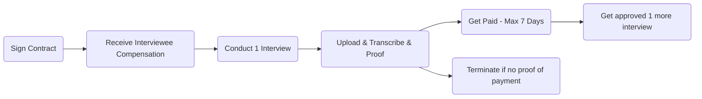

- TASK:
- [ ] Mental health Clause? 

[TOC]

# SERVICE CONTRACT

## Definitions

**Client**: Peak Shift Ltd.

**Service Provider**: Individual {{SERVICE_PROVIDER_NAME}} referred to as the "Provider" or "Service Provider"

**Director**: Johns Beharry

**information**: data about the financial habits of the interviewed participant.

**interviewee**: the individuals which the PROVIDER has contracted in order to gather information.

**data processing agreement** : an integral part of this contract setting out the personal data protection policy between the parties

**Fee**: an exchange of goods in the form of Bitcoin received as a form of payment from the CLIENT to the PROVIDER and the PROVIDER to the Interviewee.

**meta data**: Highlighted certain aspects of an interview. 
e.g. Device, Work position/title, Payment preferences, Technical certifications (laptop,phone type, SD card,PC,e-mail type, have they lost phone, phone storage capacity) 

-----------------

This, **XX.XX.2020** in the city of Sofia, between:

{{COMPANY_NAME}}, a company registered in the Commercial Register of the Registry Agency with Unique ID Code **204478925**, with seat and registered address at {{COMPANY_ADDRESS}}, represented by the Manager **Johns Beharry**, hereinafter referred to as "**CLIENT**" , on the one hand,

and

names, address, ID number, telephone, email, ..... , hereinafter referred to as "**SERVICE PROVIDER**", on the other hand, individually referred to as "Party" or collectively as "Parties",

the present service agreement was signed:

## I. SUBJECT OF THE AGREEMENT

### Art. 1.  General Terms
**CLIENT** hereby  assigns and **SERVICE PROVIDER** agrees to provide at **CLIENT** services, described below, in compliance with the legal requirements of the respective matter:

1. To host, record and store audio interviews with individuals of his choosing regarding their financial attitudes, situation and habits. 
2. To transcribe the audio interviews and provide the CLIENT with the collected information in accordance with the Data processing agreement.
3. Structure the meta data derived from interviews in the transcribed file. 

### Art. 2. Further Contractual Arrangements

Any services not stated above should be considered as out of the scope of this Agreement and are subject to arrangement in an appendix hereto or in a new agreement.

### Art. 3. Data protection measures taken
1. All measures taken to ensure the protection of the personal information collected can be found in the Data Processing Agreement (Appendix 2).
 
2. In a case that the Data Processing Agreement does not sufficiently cover the provisions of the national law of the country of residency of the interviewee regarding the processing and protection of personal information, it is the sole duty of the **SERVICE PROVIDER** to adhere to the appropriate national law's provisions.

## II. RIGHTS AND OBLIGATIONS OF THE CLIENT

### Art. 4. CLIENT is entitled to

1. To receive current and true information about the work process of the **SERVICE PROVIDER** and the information gathered.
2. To control and give opinions and recommendations in respect of the activities of **SERVICE PROVIDER**;
3. To require that the fee paid to **SERVICE PROVIDER** is documented as agreed upon hereunder according to the terms and conditions of this Agreement. 

### Art. 5. CLIENT takes upon themselves

1. To hand over to **SERVICE PROVIDER** any required information and any documents related to the performance of the service, as well as to any other documents that have not been delivered but are relevant to the methodology of the performance of the assigned work;

2. Responsibility for the correctness of the documents and records delivered to **SERVICE PROVIDER** for processing. The contents and availability of the mandatory details of the documents as well as statements shall be sole responsibility of the **CLIENT**;

3. Not to deviate from and to comply with the personal data gathering methodology, policy and document flow as agreed upon between the parties in the data processing agreement which forms an integral part of the contract. 

4.   To pay **SERVICE PROVIDER** the fee as agreed upon hereunder according to the terms and conditions of this Agreement;

5.   To provide **SERVICE PROVIDER** with a technical solution and instructions concerning the uploading and handling of the gathered information to the ASSIGNOR.

6.    To provide the **SERVICE PROVIDER** with a standard services contract that is to be signed between the **SERVICE PROVIDER** and the interviewee. 

## **III.      RIGHTS AND OBLIGATIONS OF THE SERVICE PROVIDER**

### Art. 6.  SERVICE PROVIDER's rights

1. To receive the fee agreed upon hereunder;

2. To request information from **CLIENT** about anything **SERVICE PROVIDER** deems necessary for the proper performance of its duties under this agreement ;

3. To receive any documents necessary for the proper performance of its duties under this agreement;

4. To use at its expense the services of other persons or companies to accomplish the intention of this Contract being responsible for their actions as if taken by **SERVICE PROVIDER**.

### Art. 7.  SERVICE PROVIDER's obligations

1. To organize and keep the information gathered for the purpose of this contract until its handling to the **CLIENT** as agreed upon in the Data processing agreement between the parties.
2. To sign a contract provided by the **CLIENT** with the individuals the **SERVICE PROVIDER** is interviewing.
3. To provide to the **CLIENT** a proof of the payment he has made to the individual interviewed (Interviewee) in a maximum of a 14 days after the interview has been carried out.
4. Tо monitor and properly apply any occurring changes in the existing legislation that are relevant to the subject of this Agreement;
5. To document the fees received from **CLIENT** and to provide to the **CLIENT** a proof of the payment which has been received by **SERVICE PROVIDER** in a maximum of a 14 days period after the survey has been carried out and the provisions of Art.7.3 of this contract have been met. The proof can be in a form of a screenshot of received fee.
6. Not to disclose any personal information in any form whatsoever received during or in connection with the performance of this Agreement unless agreed upon by the **CLIENT** as agreed hereunder in the Data Protection and Confidentiality section.
7. To dispose of all information collected after handing it to the **CLIENT** as agreed upon in the Data Processing Agreement, an integral part of this contract.

 

## **IV. NON-SOLICITATION**

### Art. 8. Solicitation
**SERVICE PROVIDER** may only employ third parties to assist him in the performance of the contract after a written consent from the **CLIENT** and in accordance with the applicable law. 

## **V. FEE**

### Art. 9. Methodology of payment
1. The CLIENT shall repay the SERVICE PROVIDER in the form of the cryptocurrency "Bitcoin". 
2. The amount of Bitcoin received will be calculated as the equivalent of  {{provider_fee}} USD in accordance with the current exchange rate of Bitcoin to dollar at the time of sending, listed on coinmarketcap.com. All prices are exclusive VAT.
3. The CLIENT shall repay the SERVICE PROVIDER in a maximum of 14 days after the service has been completed and the information gathered by SERVICE PROVIDER transfered to the CLIENT as agreed upon in Art.7 of this contract.

*Set amount per interview (first 30 mins, but not less than 20 min), then X equivalent of {{PROVIDER_FEE}} USD in accordance with the current exchange rate of Bitcoin to dollar  per minute, up to a maximum of {{MAX_INTERVIEW_TIME}} minutes.
Maximum amount of interviews one can do : 100
you make a request for 10 interviews to do 10 interviews. APPROVAL for .. 1,5,10,25,50
Due time to complete the interview. If they dont do the 5 interviews in 14 days they lose the 5 approval.  they get payed for only what was done.
To give them Approval for one by e-mail and then more if need be.*

### Art.10. Proof of payment
PROVIDER shall issue a proof of the received cryptocurrency as stated in Art.7.5. of this contract.

## **VI. AMENDMENTS AND TERMINATION OF THE AGREEMENT** 

### Art. 11. Amendments and Termination

1. Any amendments to this Agreement must be made in writing and signed by both parties.

2. Either party may terminate the Agreement by a three-month notice to the other party. Either party may terminate the Agreement with immediate effect if the other party commits a material breach of any provision hereof.

4. This contract shall become effective on the Effective Date and shall, unless otherwise terminated in accordance with the provisions hereof, continue in effect for an indefinite term of years.

3. In the case that the **SERVICE PROVIDER** terminates the contract the parties agree that **SERVICE PROVIDER** must hand over and dispose of any and all personal information gathered from Interviewees. 

## **VII.     NOTICE**

### Art. 12. Notice terms
To avoid any misunderstanding any notices in respect of the services, including the notice of termination, must be made in writing and delivered by courier, e-mail, or by hand to the following contacts.

Company info: {{company_website}}
E-mail: {{company_e-mail}}
Address: {{company_address}}
Tel: {{company_telephone}}

 

## **VIII.    OTHER PROVISIONS**

### Art. 13.  Disputes resolution
Any disputes arising out of the performance of this Agreement shall be settled by mutual agreement and in case this is not possible any such dispute shall be settled according to the Civil Procedural Code, the Obligations and Contracts Act and the existing Bulgarian legislation.

 

## **IX. DATA PROTECTION AND CONFIDENTIALITY** 

### Art. 14. Data protection measures taken
1. **SERVICE PROVIDER** hereby acknowledges that **SERVICE** **PROVIDER** has taken all technical, organizational and procedural actions to ensure an effective level of personal data protection according to the provisions of the applicable law. **SERVICE PROVIDER is authorized to  process personal data provided by CLIENT in order to perform the services hereunder.** The **CLIENT** and the **SERVICE PROVIDER** shall set out in detail their personal data protection arrangements in relation to the General Data Protection Regulation in a stand-alone agreement, as an integral part of this Contract
(Appendix № 2 - Data Processing agreement)

 

2. **SERVICE PROVIDER** shall keep the information of its clients in strict confidence. All employees of **SERVICE PROVIDER** are notified of the importance of the rules of confidentiality and have committed to confidentiality. 

 

### Art. 15. Non-Disclosure 
1. **SERVICE PROVIDER** shall not disclose any information related to **CLIENT** or its business unless required by law or the information becomes publicly available or when disclosure of such information has been approved by **CLIENT** in advance.
2. **SERVICE** **PROVIDER** may disclose information to the tax or legal consultants of **CLIENT** and its auditors without the prior consent of **CLIENT**, however, only in relation to the services stated hereunder.

 

 
| Client                                   | Service Provider                         |
| ---------------------------------------- | ---------------------------------------- |
| Signature    ------------------ | Signature    ------------------ |

The contract is in force effective ____.____2020
